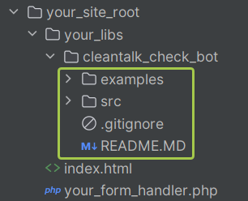

This guideline will help you to use CleanTalk check_bot API method via the special library that can be downloaded from this repo.
## Usage
1. Download the lib and unpack it to your filesystem. Look at the suggested files structure with unpacked data highlighted:
<br><br>
   <br><br>
2. Add the CleanTalk Bot-detector JS library wrapper `https://moderate.cleantalk.org/ct-bot-detector-wrapper.js` as `<script>`tag to the HTML page contains the form you want to protect.
```html
<script src="https://moderate.cleantalk.org/ct-bot-detector-wrapper.js"></script>
```
3. Fill the [config.php](src%2FCleantalk%2Fconfig.php). 
```php
src/FCleantalk/config.php
```
&nbsp;&nbsp;&nbsp;&nbsp;Obligatory properties are:
   * access_key - your CleanTalk access key. If you do not have a key, [register the new account](https://cleantalk.org/register) or [restore access](https://cleantalk.org/help/access-to-dashboard) to an existing account to get it.
   * trust_cleantalk_decision - set this to true if you do not want to set custom checking settings

4. To start use CheckBot library, include "yourpath/src/autoloader.php" into the top of codepage where you want to perform the check.
```php
require_once 'yourpath/src/autoloader.php';
```
5. Then create a new CleanTalk\CheckBot object, provide $_POST or filtered POST data to the constructor.

```php
$bot_checker = new \Cleantalk\CheckBot($_POST);
```

6. Then perform the check:
```php
$is_bot = $bot_checker->check()->getVerdict();
```

7. Then do the actions depending on the verdict.
```php
if ( $is_bot ) {
  die ($bot_checker->getBlockMessage());
}
```

8. How it looks in the suggested files structure:
- `index.html`:
```html
<!DOCTYPE html>
<html lang="en">
   <head>
   <meta charset="UTF-8">
   <title>Title</title>
   <!--Bot-detector JS library wrapper. This script must be added to the HTML of the page.-->
   <script src="https://moderate.cleantalk.org/ct-bot-detector-wrapper.js"></script>
</head>
<body>
   <form method="post" action="your_form_handler.php">
      <label for="search_field">What do you search?</label>
      <input type="text" name="search_field" id="search_field" /> <br />
      <input type="submit" />
   </form>
</body>
</html>
```
- `your_form_handler.php`:
```php
<?php
//your_libs\cleantalk_check_bot\src
require_once 'your_libs/cleantalk_check_bot/src/autoloader.php';

if ( empty($_POST) ) {
    return;
} else {
    handle_search_form($_POST);
}

/**
 * Main search from handler.
 * @param $post
 * @return void
 */
function handle_search_form($post)
{
    if ( empty($post['search_field']) ) {
        return;
    }

    //create a new CheckBot object 
    $bot_checker = new \Cleantalk\CheckBot($post);

    //call visitor check and make decision
    $is_bot = $bot_checker->check()->getVerdict();
    if ( $is_bot ) {
        die ($bot_checker->getBlockMessage());
    }

    //implement your further search form handlers here replacing echo
    echo('You searched for this: ' . $post['search_field']);
}
```
## Config setup explanation

### Default config.php
```php
<?php
global $check_bot_config;
$check_bot_config = array(
    'access_key' => "",
    'trust_cleantalk_decision' => true,
    'block_no_js_visitors' => true,
    'common_block_message' => 'Visitor blocked. It seems to be a bot.',
    'bot_expectation' => 0.5,
    'ip_frequency_24hour' => 50,
    'ip_frequency_1hour' => 15,
    'ip_frequency_10min' => 5,
    'do_log' => false
);
```

### Common params

- `access_key (string)`
  <br><br>
Your CleanTalk access key.
  <br><br>
- `trust_cleantalk_decision (bool)`
  <br><br>
Set this to true if you do not want to set custom checking settings. Applicable in the most cases. 
  <br><br>
- `block_no_js_visitors (bool)`
  <br><br>
Set this to true if you want to block any visitor that could not execute JS script (bot-like behavior). Applicable in the most cases.
  <br><br>
- `common_block_message (string)`
  <br><br>
A message for blocked visitor.
  <br><br>
- `do_log (bool)`
  <br><br>
Set to true if you want to see the log in the PHP error log, false otherwise.

### Custom params
<em>Params below affected only if the property "trust_cleantalk_decision is set to false.</em>

- `bot_expectation`
<br><br>
Set maximum bot probability percentage. For example, 0.5 is 50%. If CleanTalk API responsed with bot_expectation 0.53 - visitor will be blocked, if 0.47 - passed.
<br><br>
- `ip_frequency_24hour`,`ip_frequency_1hour`,`ip_frequency_10min`
<br><br>
Custom checks - set how to block a visitor whose IP address detected by CleanTalk service in the period. For example, if CleanTalk response contains ip_frequency_24hour = 1000, and the config property ip_frequency_24hour = 500, visitor will be blocked.

## How to test
1. Disable JavaScript implementation in your web-browser. If the param `trust_cleantalk_decision` is set to `true`, you are blocked when you try to send the form.
2. Install the solution on a dev site with visiting opened. Then set the param `do_log` to `true`. You will see how the CheckBot works in the PHP error log.

## Examples
Examples of the form with CheckBot integrated can be found in the `/examples` folder. Note: the examples does not contain the lib itself.
